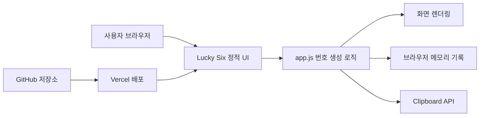
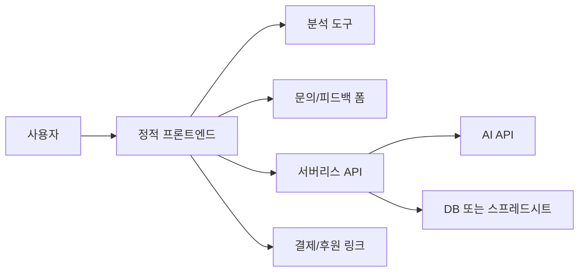

# 서비스 구조도

## 현재 구조

## 확장 구조

## 프론트엔드와 백엔드 역할

| 영역 | 현재 역할 | 확장 시 역할 |
| --- | --- | --- |
| 프론트엔드 | 번호 생성, 결과 표시, 기록, 복사 | 사용자 입력, 분석 이벤트 전송, AI 결과 표시 |
| 백엔드 | 없음 | AI API 키 보호, 문의 데이터 저장, 결제 웹훅 처리 |
| 데이터베이스 | 없음 | 피드백, 저장 기록, 사용자 설정 |
| 외부 API | 없음 | AI, 분석, 폼, 결제 |

## 데이터 흐름

1. 사용자가 `추첨하기` 버튼을 누른다.
2. 브라우저의 JavaScript가 1부터 45 사이의 번호를 무작위로 섞는다.
3. 메인 번호 6개와 보너스 번호 1개를 분리한다.
4. 메인 번호를 오름차순으로 정렬한다.
5. 결과를 화면에 렌더링하고 최근 기록에 추가한다.
6. 사용자가 복사 버튼을 누르면 Clipboard API 또는 대체 복사 흐름을 사용한다.
7. 사용자가 초기화 버튼을 누르면 현재 결과와 기록을 지운다.

## 직접 구현할 기능

- 정적 UI와 반응형 레이아웃
- 중복 없는 번호 생성
- 최근 기록 5개 제한
- 복사와 초기화
- SEO 기본 파일
- 배포 설정

## 외부 서비스로 대체할 기능

- 호스팅: Vercel
- 소스 백업: GitHub
- 분석: Vercel Analytics, Google Analytics, Plausible 중 선택
- 문의/피드백: Tally, Google Forms, Supabase 중 선택
- AI 기능: OpenAI API 또는 대체 AI API
- 결제: Stripe, Lemon Squeezy, Toss Payments 중 선택
